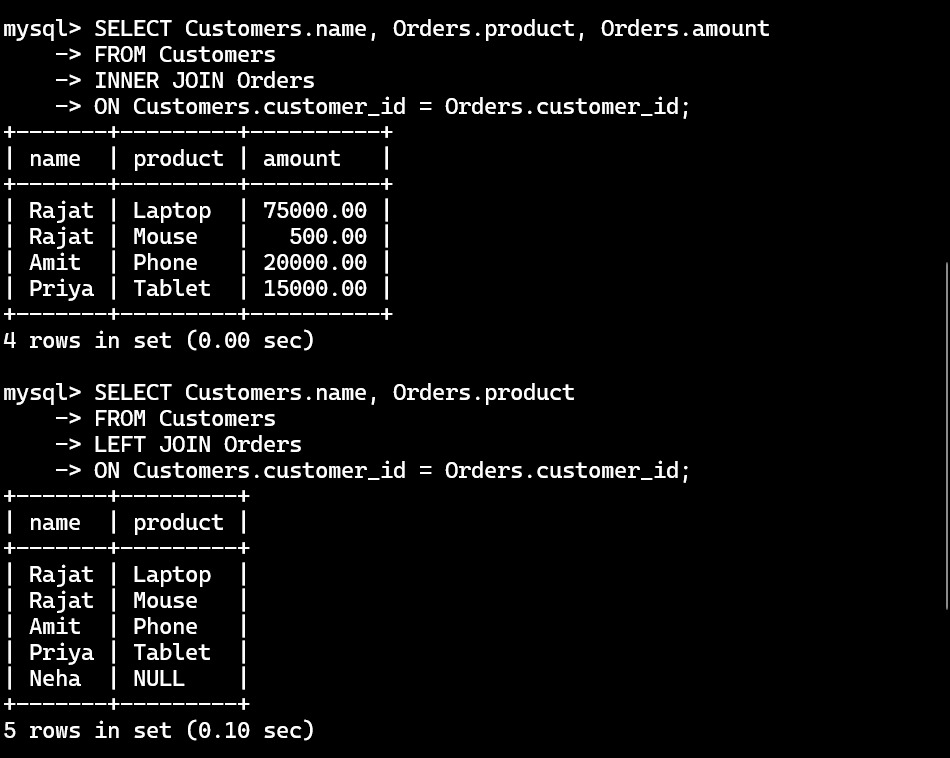
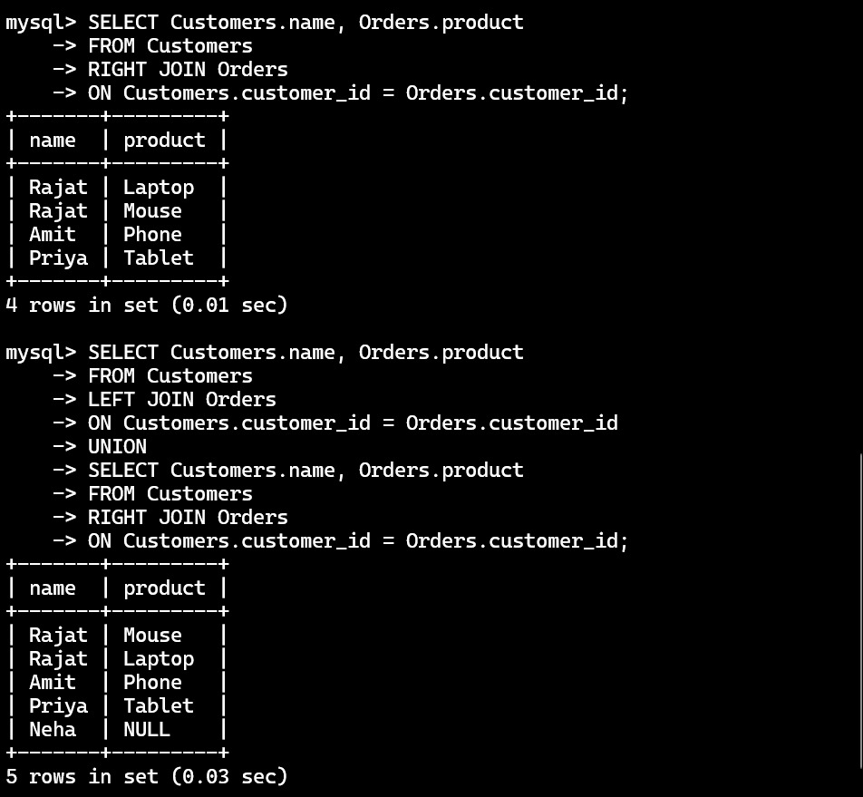

# 🚀 SQL Joins Visual Guide

> **Repository:** *SQL Developer Internship (Task 5)*  
> Learn & demonstrate SQL JOINs (INNER, LEFT, RIGHT, FULL) using `Customers` & `Orders` tables.

---

## 📊 Sample Data Tables

<table>
  <tr>
    <td valign="top">

**Customers**

| customer_id | name  | city      |
|:-----------:|:-----:|:---------:|
| 1           | Rajat | Delhi     |
| 2           | Amit  | Mumbai    |
| 3           | Priya | Bangalore |
| 4           | Neha  | Chennai   |

</td>
    <td valign="top">

**Orders**

| order_id | customer_id | product | amount |
|:--------:|:-----------:|:-------:|:------:|
| 101      | 1           | Laptop  | 75000  |
| 102      | 1           | Mouse   | 500    |
| 103      | 2           | Phone   | 20000  |
| 104      | 3           | Tablet  | 15000  |

</td>
  </tr>
</table>

---

# 🔗 SQL Join Cheatsheet

## 1️⃣ INNER JOIN

```sql
SELECT Customers.name, Orders.product, Orders.amount
FROM Customers
INNER JOIN Orders ON Customers.customer_id = Orders.customer_id;
```

<table>
  <tr>
    <td valign="top">

| name  | product | amount  |
|-------|---------|--------|
| Rajat | Laptop  | 75000  |
| Rajat | Mouse   | 500    |
| Amit  | Phone   | 20000  |
| Priya | Tablet  | 15000  |

</td>
    <td valign="top">
       <br />
      <b>Returns only rows with matches in both tables.</b><br><span style="color:gray">Find related data present in both tables.</span>
    </td>
  </tr>
</table>

---

## 2️⃣ LEFT JOIN

```sql
SELECT Customers.name, Orders.product
FROM Customers
LEFT JOIN Orders ON Customers.customer_id = Orders.customer_id;
```

<table>
  <tr>
    <td valign="top">

| name  | product |
|-------|---------|
| Rajat | Laptop  |
| Rajat | Mouse   |
| Amit  | Phone   |
| Priya | Tablet  |
| Neha  | NULL    |

</td>
    <td valign="top">
       <br />
      <b>All left table rows, matched right table data, NULL if no match.</b><br><span style="color:gray">Find all customers, even those with no orders.</span>
    </td>
  </tr>
</table>

---

## 3️⃣ RIGHT JOIN

```sql
SELECT Customers.name, Orders.product
FROM Customers
RIGHT JOIN Orders ON Customers.customer_id = Orders.customer_id;
```
> ⚠ <b>Note:</b> SQLite does <u>not</u> support RIGHT JOIN directly.

<table>
  <tr>
    <td valign="top">

| name  | product |
|-------|---------|
| Rajat | Laptop  |
| Rajat | Mouse   |
| Amit  | Phone   |
| Priya | Tablet  |

</td>
    <td valign="top">
       <br />
      <b>All right table rows, matched left table data.</b><br><span style="color:gray">Find all orders, even those with no linked customer.</span>
    </td>
  </tr>
</table>

---

## 4️⃣ FULL OUTER JOIN

```sql
SELECT Customers.name, Orders.product
FROM Customers
LEFT JOIN Orders ON Customers.customer_id = Orders.customer_id
UNION
SELECT Customers.name, Orders.product
FROM Customers
RIGHT JOIN Orders ON Customers.customer_id = Orders.customer_id;
```
> ⚠ <b>Note:</b> FULL OUTER JOIN not directly supported in SQLite/MySQL; workaround is with UNION.

<table>
  <tr>
    <td valign="top">

| name  | product |
|-------|---------|
| Rajat | Laptop  |
| Rajat | Mouse   |
| Amit  | Phone   |
| Priya | Tablet  |
| Neha  | NULL    |

</td>
    <td valign="top">
       <br />
      <b>All rows from both tables, NULL if no match.</b><br><span style="color:gray">Complete view: all customers & all orders, even unmatched.</span>
    </td>
  </tr>
</table>

---

## 🎨 Implementation Previews




---

## 🏆 Key Takeaways

- **INNER JOIN**: Only matching records from both tables.
- **LEFT JOIN**: All left table records + matching right table data.
- **RIGHT JOIN**: All right table records + matching left table data.
- **FULL OUTER JOIN**: All records from both tables; NULLs for non-matches.
- **NULL Handling**: NULLs indicate missing data from one side in joins.
- **Practical Use**: Choose join type based on the analysis needed!

---

>   
> **Happy Querying!**  
> Experiment with join types for powerful data insights.
